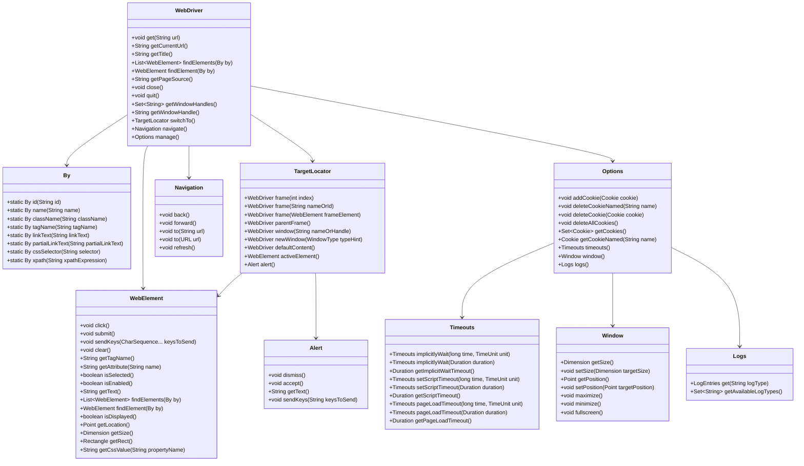

```mermaid
classDiagram
    class WebDriver {
        +void get(String url)
        +String getCurrentUrl()
        +String getTitle()
        +List~WebElement~ findElements(By by)
        +WebElement findElement(By by)
        +String getPageSource()
        +void close()
        +void quit()
        +Set~String~ getWindowHandles()
        +String getWindowHandle()
        +TargetLocator switchTo()
        +Navigation navigate()
        +Options manage()
    }

    class WebElement {
        +void click()
        +void submit()
        +void sendKeys(CharSequence... keysToSend)
        +void clear()
        +String getTagName()
        +String getAttribute(String name)
        +boolean isSelected()
        +boolean isEnabled()
        +String getText()
        +List~WebElement~ findElements(By by)
        +WebElement findElement(By by)
        +boolean isDisplayed()
        +Point getLocation()
        +Dimension getSize()
        +Rectangle getRect()
        +String getCssValue(String propertyName)
    }

    class By {
        +static By id(String id)
        +static By name(String name)
        +static By className(String className)
        +static By tagName(String tagName)
        +static By linkText(String linkText)
        +static By partialLinkText(String partialLinkText)
        +static By cssSelector(String selector)
        +static By xpath(String xpathExpression)
    }

    class TargetLocator {
        +WebDriver frame(int index)
        +WebDriver frame(String nameOrId)
        +WebDriver frame(WebElement frameElement)
        +WebDriver parentFrame()
        +WebDriver window(String nameOrHandle)
        +WebDriver newWindow(WindowType typeHint)
        +WebDriver defaultContent()
        +WebElement activeElement()
        +Alert alert()
    }

    class Navigation {
        +void back()
        +void forward()
        +void to(String url)
        +void to(URL url)
        +void refresh()
    }

    class Options {
        +void addCookie(Cookie cookie)
        +void deleteCookieNamed(String name)
        +void deleteCookie(Cookie cookie)
        +void deleteAllCookies()
        +Set~Cookie~ getCookies()
        +Cookie getCookieNamed(String name)
        +Timeouts timeouts()
        +Window window()
        +Logs logs()
    }

    class Timeouts {
        +Timeouts implicitlyWait(long time, TimeUnit unit)
        +Timeouts implicitlyWait(Duration duration)
        +Duration getImplicitWaitTimeout()
        +Timeouts setScriptTimeout(long time, TimeUnit unit)
        +Timeouts setScriptTimeout(Duration duration)
        +Duration getScriptTimeout()
        +Timeouts pageLoadTimeout(long time, TimeUnit unit)
        +Timeouts pageLoadTimeout(Duration duration)
        +Duration getPageLoadTimeout()
    }

    class Window {
        +Dimension getSize()
        +void setSize(Dimension targetSize)
        +Point getPosition()
        +void setPosition(Point targetPosition)
        +void maximize()
        +void minimize()
        +void fullscreen()
    }

    class Logs {
        +LogEntries get(String logType)
        +Set~String~ getAvailableLogTypes()
    }

    class Alert {
        +void dismiss()
        +void accept()
        +String getText()
        +void sendKeys(String keysToSend)
    }

    WebDriver --> WebElement
    WebDriver --> By
    WebDriver --> TargetLocator
    WebDriver --> Navigation
    WebDriver --> Options
    Options --> Timeouts
    Options --> Window
    Options --> Logs
    TargetLocator --> WebElement
    TargetLocator --> Alert
```